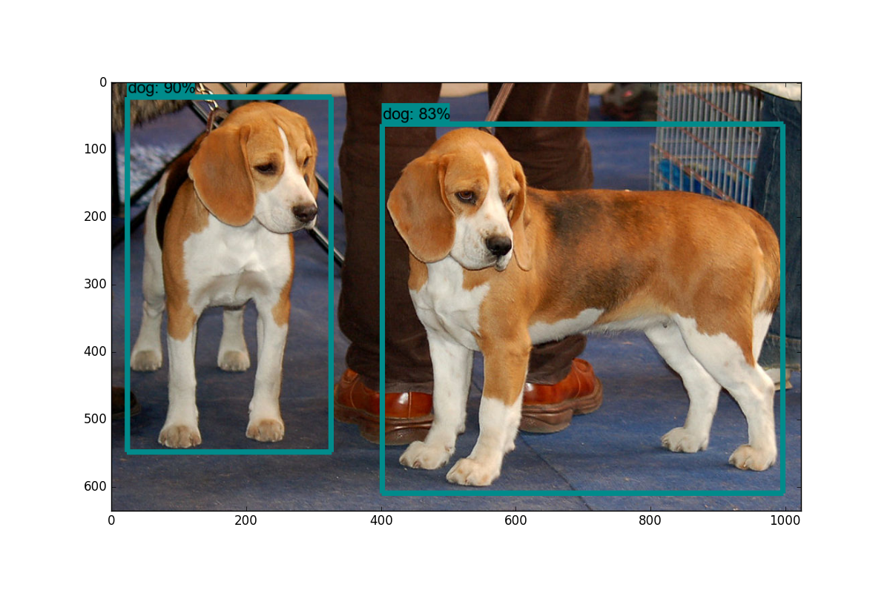
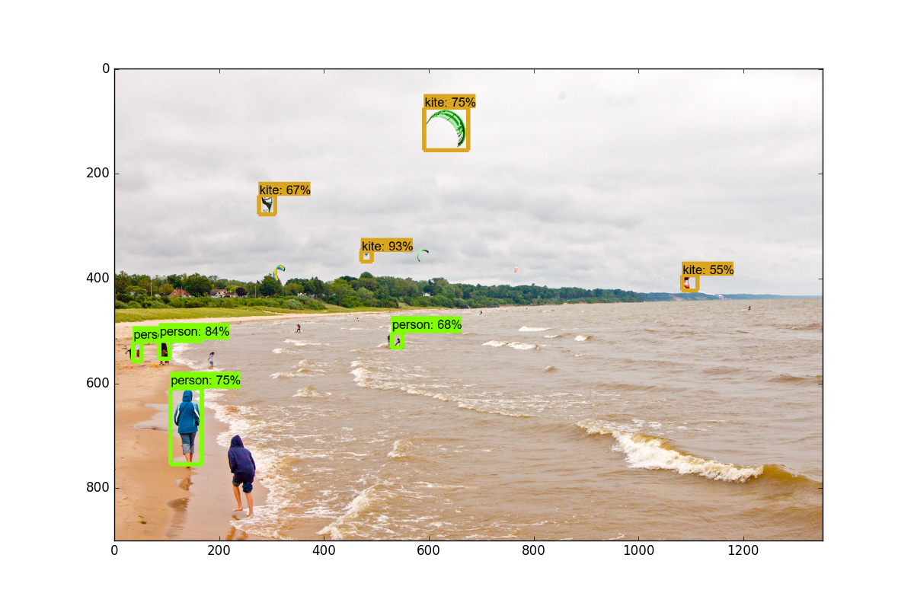

# Live-Object-Detection-Tensorflow

## SetUp

### Dependencies Setup

```
virtualenv -p python3 venv --no-site-packages
source venv/bin/activate
pip3 list
pip3 install -r requirements.txt
```

### Protobuf and model setup

https://github.com/protocolbuffers/protobuf/releases (Protoc Release Page)

> On Ubuntu:

protoc object_detection/protos/*.proto --python_out=.

And...

export PYTHONPATH=$PYTHONPATH:`pwd`:`pwd`/slim

If you get an error on the protoc command on Ubuntu, check the version you are running with protoc --version, if it's not the latest version, you might want to update. As of my writing of this, we're using 3.4.0. In order to update or get protoc, head to the protoc releases page. Download the python version, extract, navigate into the directory and then do:

```
sudo ./configure
sudo make check
sudo make install
```

After that, try the protoc command again (again, make sure you are issuing this from the models dir).

> On Windows:

Head to the protoc releases page and download the protoc-3.4.0-win32.zip, extract it, and you will find protoc.exe in the bin directory.

You can move this to something more appropriate if you like, or leave it here. I eventually put mine in program files, making a "protoc" directory and dropping it in there.

Now, from within the models (or models-master) directory, you can use the protoc command like so:

"C:/Program Files/protoc/bin/protoc" object_detection/protos/*.proto --python_out=.

### Model testing

Next, open terminal from the models/object_detection directory and open the Jupyter Notebook with jupyter notebook. From here, choose the object_detection_tutorial.ipynb. From here, you should be able to cell in the main menu, and choose run all





## CREDITS

>Kuldeep Singh Sidhu

Github: [github/singhsidhukuldeep](https://github.com/singhsidhukuldeep)
`https://github.com/singhsidhukuldeep`

Website: [Kuldeep Singh Sidhu (Website)](http://kuldeepsinghsidhu.com)
`http://kuldeepsinghsidhu.com`

LinkedIn: [Kuldeep Singh Sidhu (LinkedIn)](https://www.linkedin.com/in/singhsidhukuldeep/)
`https://www.linkedin.com/in/singhsidhukuldeep/`